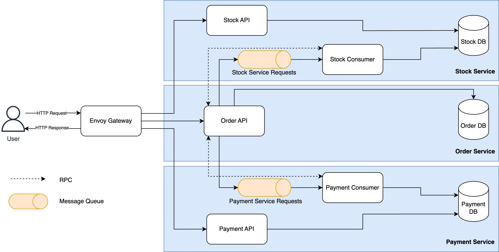

# Details about our implementation
The goal of this project is to design the architecture and define the transaction protocol for a generic E-Commerce system composed of three parts: Order, Payment, and Stock. We propose to leverage an **event-driven microservices architecture**, as our focus for this system is to achieve **high performance** while still guaranteeing **eventual consistency**. Each of the three microservices manages its own database system, and interservice communication is performed asynchronously. The figure below illustrates the proposed architecture.

## Number of replicas
We decided to replicate our services to distribute the load over multiple workers with the goal of achieving higher throughput. Specifically, we have 4 replicas of the Order Service and 2 replicas each for Stock and Payment Services.

The reason behind the different number of replicas per service is the actual load. We observed that setting each service to be replicated 4 times yielded a worse result than the current setup (i.e. lower RPS and higher response time for 10.000 users checking out simultaneously).

## Changing the load balancer
While performing stress experiments, we saw that the response time increased at a slower than linear pace. Yet, after achieving an RPS of around 5.000, we saw a significant increase in the worst case response time (over 20.000ms). Additionally, we measured the latency of the checkout procedure and resulted in a surprising value - it ranges between 2 and 20ms, depending on the load, yet the actual response time was significantly higher. After some investigations, we came to the conclusion that the Nginx load balancer could not handle the high load. Did some research and [found out](https://www.loggly.com/blog/benchmarking-5-popular-load-balancers-nginx-haproxy-envoy-traefik-and-alb/) that the [Envoy Proxy](https://www.envoyproxy.io/) promises to provide better performance than Nginx. With the new load balancer in place, we achieve higher RPS, while keeping the response time relatively constant (after the number of users has stabilized).

## Performance of the system
Regarding the performance, our system achieves high throughput with relatively low response time, while still achieving 100% consistency. Specifically, when runnning Locust with 8 workers, while the system runs the configuration described above, we achieve an average of ~6.200 RPS with a median response time of 18ms. More detailed statistics on the performance of our system can be found [here](resources/Locust_2025-03-21-18h54_locustfile.py_http___master_8089.html).

## Fault tolerance

To ensure our system is resilient to crashes and maintains consistency, we implemented fault tolerance mechanisms across all services. Specifically, we distinguish between two main scenarios: fault tolerance for the Order Service and crash recovery for the Payment and Stock Services.

### Payment and Stock Services

In the case of the Payment and Stock Services, we rely on RabbitMQ’s **Dead Letter Queue (DLQ)** to handle crashes during request processing. If a replica crashes after receiving a request from the Order Service but before completing its task, RabbitMQ automatically places the unacknowledged message into the DLQ. At this point, we know which task failed, but we cannot be certain whether partial changes were already applied to the corresponding Redis database.

To address this, we implemented a **logging mechanism** that maintains a stream of operations—both *updates* and *rollbacks*—in Redis. Each operation is tagged with a unique `log_id`, which is generated by the Order Service and passed along with the request via RabbitMQ. When a message ends up in the DLQ, we use this `log_id` to inspect the logs and determine whether any partial operations need to be reverted. This ensures that the system remains consistent, even in the presence of partial failures.

### Order Service

The Order Service poses a different challenge: not only do we need to identify incomplete actions, but we also must detect whether a crash has occurred during a transaction. To handle this, we implemented a specialized logging mechanism within the Order Service’s Redis database.

At the start of a checkout request, the Order Service logs the set of `log_ids` that correspond to the actions it intends to trigger in the Payment and Stock Services. These `log_ids` are then sent along with each action to the respective services. Unlike the logs in the other services, the Order Service’s logs do not contain the action data themselves, but rather metadata that allows us to trace which actions were planned.

Each log entry includes:
- A unique `replica_id`, identifying the Order Service replica that initiated the action
- The `order_id` of the transaction
- The set of planned `log_ids` associated with all the possible actions than can be triggered in payment and stock services.

When a replica crashes and another replica takes over, the new instance uses the `replica_id` to retrieve uncompleted logs from the previous instance. It then verifies whether any corresponding actions were recorded in the Payment or Stock Services and performs rollbacks where necessary. Once all partial actions are reverted, the order status is reset to **unattempted**, allowing the system to retry the transaction safely.

## Locust with multiple workers
We saw that running Locust with only one worker cannot measure properly the performance of the system. Thus, we ran Locust with multiple workers by running an image of Locust with the docker-compose responsible for the system. 

Once Locust and the system are running, you can access Locust's dashboard at: `http://0.0.0.0:8089/?tab=charts`.

## Running the project

Run `docker-compose up --build` in the base folder to open the system.

***Requirements:*** You need to have docker and docker-compose installed on your machine. 
